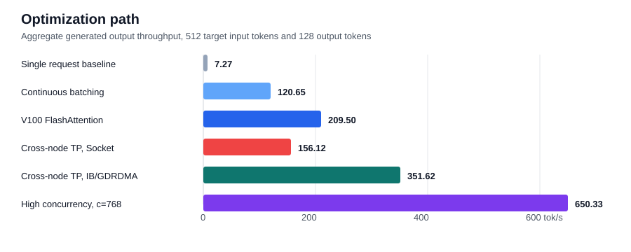
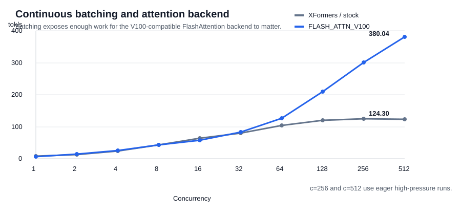
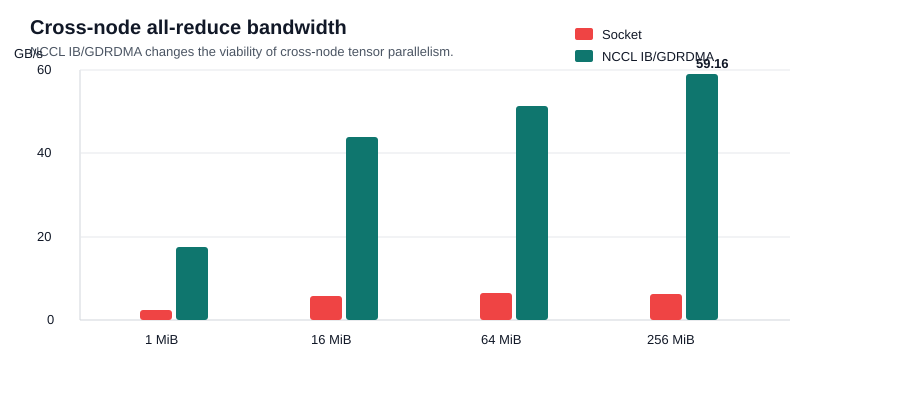
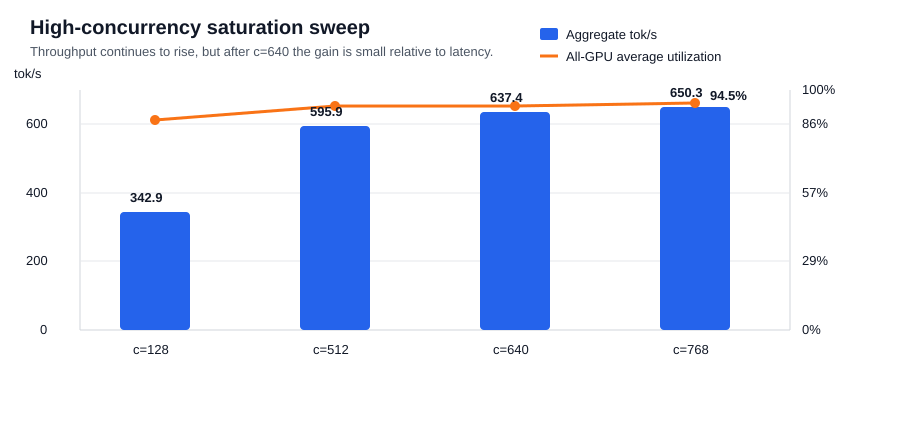
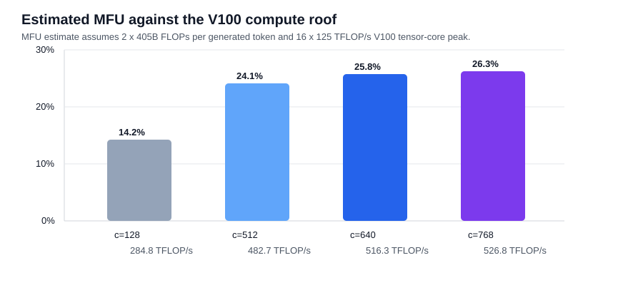

# Llama 405B Inference Throughput on Taiwania 2

This project studies throughput-oriented inference for one large dense model on a fixed HPC allocation: 2 nodes, 16 NVIDIA V100 GPUs, and one hour per Slurm job.

Using the same allocation, throughput improved from `7.27 tok/s` for one stock vLLM request to `351.62 tok/s` at `c=128` after batching, a V100-compatible FlashAttention backend, and NCCL InfiniBand/GDRDMA transport. The highest measured throughput was `650.33 tok/s` at `c=768`.

The experiment uses one main workload rather than comparing many models. The question is:

> How much can large-model inference throughput improve on older V100 HPC nodes when inference is treated as a systems problem?

The three systems levers are:

- Continuous batching.
- V100-compatible attention kernels.
- Cross-node parallelism with the correct NCCL transport.

## External Benchmark Context

Public LLM inference benchmarks usually frame the problem as a throughput and latency tradeoff under a defined workload, not only as a model-loading exercise. MLPerf Inference includes `llama3.1-405b` as a datacenter workload and documents both Offline and Server scenarios for Llama 3.1 405B. NVIDIA TensorRT-LLM reports maximum-load throughput as `Total Output Throughput (tokens/sec)` and publishes Llama 3.1 405B FP8 results on newer H100/H200 GPUs.

This project uses those benchmarks as context rather than as a direct ranking target. The hardware, precision, runtime, and prompt lengths are different. The comparison is used to shape the story: can an older V100 HPC allocation reproduce the same systems-oriented way of thinking under a one-hour Slurm limit?

| External reference | What it contributes | Why it is not a direct comparison |
| --- | --- | --- |
| [MLPerf Inference Llama 3.1 405B](https://docs.mlcommons.org/inference/benchmarks/language/llama3_1-405b/) | Offline and Server benchmark framing for a 405B-class LLM | Different benchmark harness, dataset, compliance rules, and hardware assumptions |
| [MLCommons inference repository](https://github.com/mlcommons/inference) | Lists `llama3.1-405b` as a datacenter inference workload | MLPerf submissions are standardized workloads, while this project is a constrained HPC course experiment |
| [TensorRT-LLM performance overview](https://nvidia.github.io/TensorRT-LLM/performance/perf-overview.html) | Published maximum-load output throughput for Llama 3.1 405B on H100/H200 | Newer GPUs, FP8, TensorRT-LLM, and different input/output lengths |
| [NVIDIA Tesla V100](https://www.nvidia.com/en-gb/data-center/tesla-v100/) | V100 tensor-core peak performance used for the efficiency estimate | Peak FLOP/s is only an upper bound, not an inference throughput prediction |

One useful public scale point is TensorRT-LLM's `2048/128` Llama 3.1 405B FP8 row. Its benchmark reports maximum-load `Total Output Throughput (tokens/sec)`. The numbers below should be read as context for workload scale, not as a claim that the V100 result is faster than modern GPUs.

| Source | Hardware | Runtime / precision | Input / output | Output tok/s | Note |
| --- | --- | --- | ---: | ---: | --- |
| TensorRT-LLM public table | 8 x H100 SXM 80GB | TensorRT-LLM / FP8 | 2048 / 128 | 433.47 | Longer prefill and newer GPUs |
| TensorRT-LLM public table | 8 x H200 SXM 141GB | TensorRT-LLM / FP8 | 2048 / 128 | 441.35 | Longer prefill and newer GPUs |
| This project | 16 x V100-SXM2-32GB | vLLM / GPTQ INT4 | 512 / 128 | 650.33 | Shorter prefill, more GPUs, older hardware |

## Testbed

| Item | Setting |
| --- | --- |
| Cluster | Taiwania 2 |
| Allocation | 2 nodes, 16 x NVIDIA V100-SXM2-32GB |
| Job limit | One hour per Slurm job |
| Main model | `hugging-quants/Meta-Llama-3.1-405B-Instruct-GPTQ-INT4` |
| Quantization | GPTQ INT4 |
| Frameworks | stock vLLM `0.7.0`; V100 fork vLLM `1.1.0` |
| Attention backends | XFormers / stock; `FLASH_ATTN_V100` |
| Input / output | 512 target input tokens, 128 output tokens |
| Max model length | `1024` |
| Main metric | aggregate generated output tokens per second |

`Concurrency` is the number of in-flight requests. `Aggregate tok/s` is total generated output tokens divided by benchmark wall time. The benchmark generated prompts targeting 512 input tokens; tokenizer-specific actual input length can differ slightly.

## Main Results

The main comparison is controlled at `c=128` after the single-request baseline. This keeps request pressure fixed while changing one systems lever at a time. The final `c=768` row is included as a higher-concurrency throughput run.

| Step | Configuration | Parallelism | Concurrency | Aggregate tok/s | vs baseline |
| --- | --- | --- | ---: | ---: | ---: |
| Single-request baseline | stock vLLM / XFormers | `TP=8`, `PP=2` | 1 | 7.27 | 1.00x |
| Continuous batching | stock vLLM / XFormers | `TP=8`, `PP=2` | 128 | 120.65 | 16.60x |
| V100 FlashAttention | `FLASH_ATTN_V100` | `TP=8`, `PP=2` | 128 | 209.50 | 28.82x |
| Cross-node TP without IB transport | `FLASH_ATTN_V100` + Socket | `TP=16`, `PP=1` | 128 | 156.12 | 21.47x |
| Cross-node TP with IB/GDRDMA | `FLASH_ATTN_V100` + NCCL `NET/IB` | `TP=16`, `PP=1` | 128 | 351.62 | 48.37x |
| Higher-concurrency run | `FLASH_ATTN_V100` + NCCL `NET/IB` | `TP=16`, `PP=1` | 768 | 650.33 | 89.45x |



The important point is that `TP=16`, `PP=1` is only good after NCCL uses InfiniBand transport. With Socket transport, cross-node tensor parallelism is slower than the simpler `TP=8`, `PP=2` layout. With `NET/IB` and GDRDMA, it becomes the best layout.

## Continuous Batching And Attention

The first part of the study asks how far serving-level batching and attention kernels can go before changing the cross-node layout.

| Backend | c=1 | c=2 | c=4 | c=8 | c=16 | c=32 | c=64 | c=128 | c=256 | c=512 | Highest |
| --- | ---: | ---: | ---: | ---: | ---: | ---: | ---: | ---: | ---: | ---: | ---: |
| XFormers / stock | 7.27 | 13.25 | 24.65 | 42.77 | 64.36 | 79.91 | 103.75 | 120.65 | 124.30 | 123.92 | 124.30 |
| `FLASH_ATTN_V100` | 7.12 | 13.70 | 25.66 | 43.39 | 57.42 | 83.73 | 126.67 | 209.50 | 300.48 | 380.04 | 380.04 |



At `c=128`, `FLASH_ATTN_V100` is `73.6%` faster than stock vLLM (`209.50` vs `120.65 tok/s`). This is the first major result: batching creates enough parallel work for the attention backend to matter.

The `c=256` and `c=512` extension used eager execution because the larger high-concurrency run does not leave enough headroom for CUDA graph capture on 32GB V100 GPUs. These points are useful as throughput saturation measurements, but the cleaner backend comparison is still the `c=128` row. At `c=512`, `FLASH_ATTN_V100` reaches `380.04 tok/s`, while stock XFormers stays flat at `123.92 tok/s` with much higher latency.

The high-concurrency FlashAttention runs used `GPU_MEMORY_UTILIZATION=0.88`. Decode partition size `512` was selected because it was the best measured setting; `256` was nearly identical and `1024` was slower.

## Cross-Node Parallelism

The second part asks whether the two-node allocation should be used as pipeline parallelism across nodes or as one larger tensor-parallel group.

| Parallelism | NCCL transport | Mode | Concurrency | Aggregate tok/s | Mean latency | Mean TTFT | Mean decode tok/s |
| --- | --- | --- | ---: | ---: | ---: | ---: | ---: |
| `TP=8`, `PP=2` | default | CUDA graph | 128 | 209.50 | 78.09s | 0.80s | 1.64 |
| `TP=8`, `PP=2` | `NET/IB` + `GDRDMA` | CUDA graph | 128 | 204.70 | 80.00s | 0.75s | 1.60 |
| `TP=16`, `PP=1` | Socket | eager | 128 | 156.12 | 104.75s | 1.00s | 1.22 |
| `TP=16`, `PP=1` | `NET/IB` + `GDRDMA` | eager | 128 | 351.62 | 46.48s | 0.56s | 2.77 |
| `TP=16`, `PP=1` | `NET/IB` + `GDRDMA` | eager | 768 | 650.33 | 150.69s | 1.59s | 0.85 |

`TP=8`, `PP=2` keeps tensor-parallel collectives inside each 8-GPU node, so enabling IB/GDRDMA does not improve throughput. `TP=16`, `PP=1` spreads tensor-parallel collectives across both nodes. That layout is bad with Socket transport, but it reaches `351.62 tok/s` at `c=128` once NCCL uses `NET/IB` with GDRDMA.

The `c=768` run adds `85.0%` throughput over the controlled `c=128` result, but latency rises from `46.48s` to `150.69s`. It is useful for offline-throughput measurement, while `c=128` is the cleaner controlled comparison.

A two-node PyTorch/NCCL all-reduce microbenchmark was also used to confirm that the optimized run was not merely using an IB IP interface through Socket. The logs show `Using network IB`, GPU Direct RDMA enabled, and cross-node channels marked as `NET/IB/.../GDRDMA`.

| All-reduce message size | Socket bus bandwidth | IB/GDRDMA bus bandwidth | Speedup |
| ---: | ---: | ---: | ---: |
| 1 MiB | 2.35 GB/s | 17.46 GB/s | 7.43x |
| 16 MiB | 5.79 GB/s | 43.98 GB/s | 7.60x |
| 64 MiB | 6.39 GB/s | 51.46 GB/s | 8.06x |
| 256 MiB | 6.24 GB/s | 59.16 GB/s | 9.48x |



This supports the LLM result: the best layout depends on real NCCL InfiniBand transport, not only on selecting a network interface.

## GPU Profiling

The profiling reruns sampled `nvidia-smi` once per second during the benchmark window. They are reported separately because profiling adds small overhead and run-to-run variation.

| Configuration | Concurrency | Aggregate tok/s | Mean latency | Head avg GPU util | Worker avg GPU util | All avg GPU util | Max memory |
| --- | ---: | ---: | ---: | ---: | ---: | ---: | ---: |
| `TP=8`, `PP=2`, default NCCL | 128 | 209.22 | 78.19s | 63.4% | 91.5% | 77.4% | 31.29 GiB |
| `TP=16`, `PP=1`, NCCL `NET/IB` + `GDRDMA` | 128 | 342.90 | 47.65s | 87.4% | 87.5% | 87.4% | 25.99 GiB |
| `TP=16`, `PP=1`, NCCL `NET/IB` + `GDRDMA` | 512 | 595.89 | 109.62s | 93.7% | 93.3% | 93.5% | 29.49 GiB |
| `TP=16`, `PP=1`, NCCL `NET/IB` + `GDRDMA` | 640 | 637.37 | 128.12s | 93.8% | 93.1% | 93.5% | 30.03 GiB |
| `TP=16`, `PP=1`, NCCL `NET/IB` + `GDRDMA` | 768 | 650.33 | 150.69s | 94.5% | 94.5% | 94.5% | 30.32 GiB |



The `TP=8`, `PP=2` layout keeps tensor parallelism local to each node, but the pipeline stages are not equally busy. The head node averaged only `63.4%` GPU utilization while the worker node averaged `91.5%`.

The `TP=16`, `PP=1` layout removes that pipeline imbalance and makes all 16 GPUs participate in one tensor-parallel group. That is why the GPU utilization becomes much more balanced once NCCL transport is fixed.

The high-concurrency sweep shows that `c=768` is close to practical saturation for this workload: GPU utilization reaches `94.5%`, memory use reaches `30.32 GiB`, and further concurrency would mainly trade latency for limited additional throughput.

## Hardware Efficiency Estimate

To give the throughput numbers a hardware scale, the report estimates a simple model FLOP utilization (MFU). This is not a profiler-derived hardware FLOP counter. It is a roofline-style estimate using dense-model decode cost and the published V100 tensor-core peak.

```text
FLOPs/token ~= 2 x model parameters
Useful model TFLOP/s = aggregate tok/s x 2 x 405B / 1e12
Estimated MFU = useful model TFLOP/s / (16 x 125 TFLOP/s)
```

| Configuration | Aggregate tok/s | Useful model TFLOP/s | Estimated MFU | GPU util |
| --- | ---: | ---: | ---: | ---: |
| `TP=16`, `PP=1`, IB/GDRDMA, c=128 | 351.62 | 284.8 | 14.2% | 87.4% |
| `TP=16`, `PP=1`, IB/GDRDMA, c=512 | 595.89 | 482.7 | 24.1% | 93.5% |
| `TP=16`, `PP=1`, IB/GDRDMA, c=640 | 637.37 | 516.3 | 25.8% | 93.5% |
| `TP=16`, `PP=1`, IB/GDRDMA, c=768 | 650.33 | 526.8 | 26.3% | 94.5% |



The highest run reaches `650.33 tok/s`, which corresponds to about `526.8 TFLOP/s` of useful dense-model work. Against a simple `16 x 125 TFLOP/s = 2.0 PFLOP/s` V100 tensor-core roof, this is about `26.3%` estimated MFU. The gap between `94.5%` GPU utilization and `26.3%` MFU is the main systems interpretation: the GPUs are busy, but not all busy time is ideal dense matrix compute.

## Interpretation

Continuous batching is the first-order serving optimization. Stock vLLM improves from `7.27` to `120.65 tok/s` when concurrency increases from `1` to `128`.

The V100 FlashAttention backend matters after batching exposes enough work. At `c=128`, it raises throughput from `120.65` to `209.50 tok/s`.

The HPC-specific result is the topology and transport interaction. Cross-node tensor parallelism is not automatically better. It becomes better only after the container exposes the RDMA userspace libraries needed for NCCL `NET/IB` and GDRDMA.

The final result targets offline or batched serving throughput. The clean controlled result is `351.62 tok/s` at `c=128`; the highest measured result is `650.33 tok/s` at `c=768`.

## Additional Experiments

These checks are included only to define the boundary of the main experiment.

A 1-node / 8 x V100 run was tested for `Llama 3.1 405B GPTQ`. With `TP=8`, `PP=1`, and `max_model_len=1024`, vLLM reported that the available KV cache could store only `480` tokens, so the main workload requires the 2-node setup.

Two MoE models were tested as feasibility checks. They are not part of the main comparison because sparse MoE models have fewer active parameters per generated token.

| Model | Allocation | Parallelism | Backend | Highest aggregate tok/s |
| --- | --- | --- | --- | ---: |
| `Qwen3 235B-A22B MoE GPTQ` | 1 node / 8 x V100 | `TP=8`, `PP=1` | `FLASH_ATTN_V100` | 416.17 @ c=64 |
| `Qwen3.5 397B-A17B MoE GPTQ` | 2 nodes / 16 x V100 | `TP=16`, `PP=1` | `FLASH_ATTN_V100` | 74.16 @ c=64 |

## Reproduce

Do not install packages or run inference on the login node. Create the vLLM environment through Slurm on a compute node:

```bash
cd /work/$USER/llm
sbatch slurm/setup_vllm_env.slurm
```

Run the V100 FlashAttention `c=128` baseline:

```bash
EXPERIMENT_NAME=1cat-llama31-405b-c128-flash-v100 \
GPU_MEMORY_UTILIZATION=0.88 \
MAX_NUM_SEQS=128 \
CONCURRENCY_LEVELS=128 \
RUNS_PER_CONCURRENCY_FACTOR=2 \
VLLM_FLASH_V100_DECODE_PARTITION_SIZE=512 \
sbatch slurm/vllm_1cat_llama31_405b_sweep_16v100.slurm
```

Run the highest-throughput NCCL IB/GDRDMA configuration after staging the host RDMA userspace libraries into a small directory during a Slurm job:

```bash
EXPERIMENT_NAME=1cat-llama31-405b-c768-tp16-pp1-eager-ib-p512 \
TP_SIZE=16 \
PP_SIZE=1 \
GPU_MEMORY_UTILIZATION=0.88 \
MAX_NUM_SEQS=768 \
CONCURRENCY_LEVELS=768 \
RUNS_PER_CONCURRENCY_FACTOR=2 \
VLLM_FLASH_V100_DECODE_PARTITION_SIZE=512 \
VLLM_FLASH_V100_ENABLE_PAGED_PREFILL=1 \
EXTRA_VLLM_ARGS=--enforce-eager \
NCCL_IB_DISABLE=0 \
NCCL_DEBUG=INFO \
NCCL_DEBUG_SUBSYS=INIT,NET \
APPTAINERENV_LD_LIBRARY_PATH=/path/to/rdma-libs:${LD_LIBRARY_PATH:-} \
APPTAINERENV_LIBIBVERBS_DRIVER_DIR=/path/to/rdma-libs \
LIBIBVERBS_DRIVER_DIR=/path/to/rdma-libs \
sbatch slurm/vllm_1cat_llama31_405b_sweep_16v100.slurm
```

The expected NCCL evidence in `vllm-server.log` is `Using network IB` plus channels marked `via NET/IB/.../GDRDMA`.

The useful output files are:

```text
runs/<run-id>/summary.json
runs/<run-id>/gpu_profile_summary.md
runs/<run-id>/gpu_profile_summary.json
runs/<run-id>/experiment.env
runs/<run-id>/vllm-server.log
```
